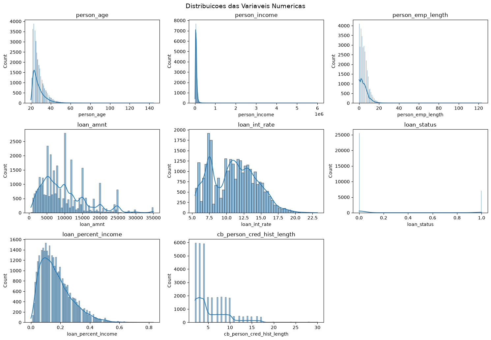
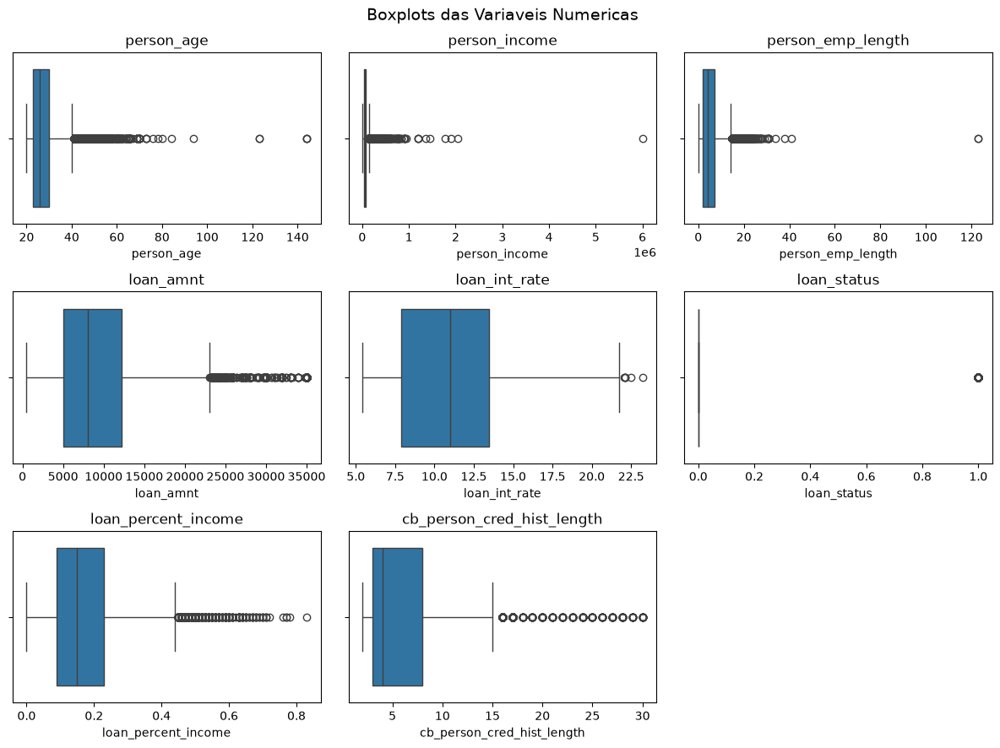
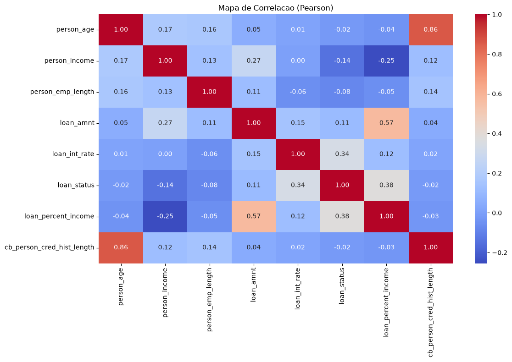
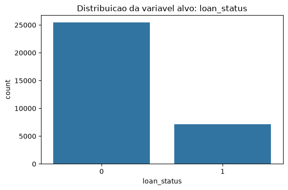
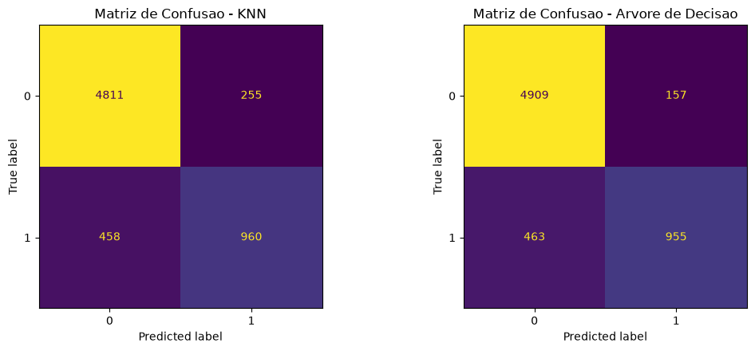

# Relatorio de Execucao - Pipeline de Machine Learning


## CARREGANDO BASE

**[OK]** Base carregada com sucesso.


## DIMENSOES

- **Linhas:** 32581
- **Colunas:** 12


## TIPOS DE DADOS

```text
person_age                      int64
person_income                   int64
person_home_ownership             str
person_emp_length             float64
loan_intent                       str
loan_grade                        str
loan_amnt                       int64
loan_int_rate                 float64
loan_status                     int64
loan_percent_income           float64
cb_person_default_on_file         str
cb_person_cred_hist_length      int64
dtype: object
```


## ESTATISTICAS

```text
          person_age  person_income person_home_ownership  person_emp_length loan_intent loan_grade     loan_amnt  loan_int_rate   loan_status  loan_percent_income cb_person_default_on_file  cb_person_cred_hist_length
count   32581.000000   3.258100e+04                 32581       31686.000000       32581      32581  32581.000000   29465.000000  32581.000000         32581.000000                     32581                32581.000000
unique           NaN            NaN                     4                NaN           6          7           NaN            NaN           NaN                  NaN                         2                         NaN
top              NaN            NaN                  RENT                NaN   EDUCATION          A           NaN            NaN           NaN                  NaN                         N                         NaN
freq             NaN            NaN                 16446                NaN        6453      10777           NaN            NaN           NaN                  NaN                     26836                         NaN
mean       27.734600   6.607485e+04                   NaN           4.789686         NaN        NaN   9589.371106      11.011695      0.218164             0.170203                       NaN                    5.804211
std         6.348078   6.198312e+04                   NaN           4.142630         NaN        NaN   6322.086646       3.240459      0.413006             0.106782                       NaN                    4.055001
min        20.000000   4.000000e+03                   NaN           0.000000         NaN        NaN    500.000000       5.420000      0.000000             0.000000                       NaN                    2.000000
25%        23.000000   3.850000e+04                   NaN           2.000000         NaN        NaN   5000.000000       7.900000      0.000000             0.090000                       NaN                    3.000000
50%        26.000000   5.500000e+04                   NaN           4.000000         NaN        NaN   8000.000000      10.990000      0.000000             0.150000                       NaN                    4.000000
75%        30.000000   7.920000e+04                   NaN           7.000000         NaN        NaN  12200.000000      13.470000      0.000000             0.230000                       NaN                    8.000000
max       144.000000   6.000000e+06                   NaN         123.000000         NaN        NaN  35000.000000      23.220000      1.000000             0.830000                       NaN                   30.000000
```


## VALORES NULOS

```text
person_age                       0
person_income                    0
person_home_ownership            0
person_emp_length              895
loan_intent                      0
loan_grade                       0
loan_amnt                        0
loan_int_rate                 3116
loan_status                      0
loan_percent_income              0
cb_person_default_on_file        0
cb_person_cred_hist_length       0
dtype: int64
```


## DUPLICADOS

- Total de linhas duplicadas: 165














## TOMADA DE DECISAO (EDA)

> **Observacao:** A variavel alvo e fortemente desbalanceada.
> Existem valores nulos que serao tratados via media/mediana dependendo da simetria.
> Outliers serao tratados com clipping, preservando a variavel alvo.

## TRATAMENTO DOS DADOS

**[OK]** 165 duplicados removidos.


## TRATANDO NULOS

- `person_emp_length` -> Mediana (distribuicao assimetrica, skew=2.62)
- `loan_int_rate` -> Media (distribuicao aprox. simetrica, skew=0.21)

## TRATAMENTO DE OUTLIERS

**[AVISO]** Coluna alvo 'loan_status' excluida do tratamento de outliers.

**[OK]** Outliers tratados utilizando Clipping (variavel alvo preservada).


## FEATURE ENGINEERING

**[OK]** Nova coluna criada: comprometimento_renda


## PREPARACAO DOS DADOS


## ENCODING

**[OK]** Encoding realizado.


## APLICANDO SMOTE

**[OK]** Balanceamento realizado no Treino.


## STANDARDSCALER

**[OK]** Escalonamento realizado (apenas para o KNN).

**[OK]** Dados preparados e separados.


## TREINANDO KNN

```text
Modelo  Parametro  Acc_Treino  Acc_Teste  Precision  Recall     F1
   KNN          3      0.9520     0.8772     0.7389  0.6784 0.7074
   KNN          5      0.9403     0.8840     0.7690  0.6714 0.7169
   KNN          7      0.9333     0.8879     0.7798  0.6791 0.7260
   KNN          9      0.9285     0.8900     0.7901  0.6770 0.7292
```


## TREINANDO ARVORE

```text
Modelo Parametro  Acc_Treino  Acc_Teste  Precision  Recall     F1
Arvore         3      0.8493     0.8661     0.7165  0.6417 0.6771
Arvore         5      0.8883     0.8900     0.7586  0.7292 0.7436
Arvore         7      0.9060     0.9044     0.8588  0.6735 0.7549
Arvore      None      1.0000     0.8825     0.7124  0.7757 0.7427
```


## COMPARACAO DOS MODELOS

```text
Modelo Parametro  Acc_Treino  Acc_Teste  Precision  Recall     F1
Arvore         7      0.9060     0.9044     0.8588  0.6735 0.7549
Arvore         5      0.8883     0.8900     0.7586  0.7292 0.7436
Arvore      None      1.0000     0.8825     0.7124  0.7757 0.7427
   KNN         9      0.9285     0.8900     0.7901  0.6770 0.7292
   KNN         7      0.9333     0.8879     0.7798  0.6791 0.7260
   KNN         5      0.9403     0.8840     0.7690  0.6714 0.7169
   KNN         3      0.9520     0.8772     0.7389  0.6784 0.7074
Arvore         3      0.8493     0.8661     0.7165  0.6417 0.6771
```


## ANALISE DE OVERFITTING

```text
Modelo  Parametro  Acc_Treino  Acc_Teste  Diferenca
   KNN          3      0.9520     0.8772     0.0748
   KNN          5      0.9403     0.8840     0.0563
   KNN          7      0.9333     0.8879     0.0454
   KNN          9      0.9285     0.8900     0.0385
```


## ANALISE DE OVERFITTING

```text
Modelo Parametro  Acc_Treino  Acc_Teste  Diferenca
Arvore         3      0.8493     0.8661     0.0168
Arvore         5      0.8883     0.8900     0.0017
Arvore         7      0.9060     0.9044     0.0016
Arvore      None      1.0000     0.8825     0.1175
```


## RELATORIO FINAL - KNN

```text
              precision    recall  f1-score   support

           0       0.91      0.95      0.93      5066
           1       0.79      0.68      0.73      1418

    accuracy                           0.89      6484
   macro avg       0.85      0.81      0.83      6484
weighted avg       0.89      0.89      0.89      6484

```


## RELATORIO FINAL - ARVORE

```text
              precision    recall  f1-score   support

           0       0.91      0.97      0.94      5066
           1       0.86      0.67      0.75      1418

    accuracy                           0.90      6484
   macro avg       0.89      0.82      0.85      6484
weighted avg       0.90      0.90      0.90      6484

```


## MATRIZES DE CONFUSAO





## VEREDITO DE NEGOCIOS

No contexto de Risco de Credito, os erros possuem pesos financeiros drasticamente diferentes.

- **Falso Positivo:** Classificar um bom pagador como risco faz o banco perder a margem de juros da operacao.
- **Falso Negativo:** Classificar um mau pagador como confiavel resulta na perda total do montante emprestado.

Portanto, o foco de negocios deve ser minimizar os Falsos Negativos, ou seja, maximizar a metrica **RECALL da classe 1** (Inadimplentes).

Com base nas matrizes de confusao geradas, recomenda-se colocar em producao o modelo que obteve o maior Recall para a classe 1, pois e a estrategia mais segura para proteger o patrimonio da instituicao financeira.
**[OK]** Relatorio gerado com sucesso! Verifique o arquivo 'relatorio_gerado.md'.

